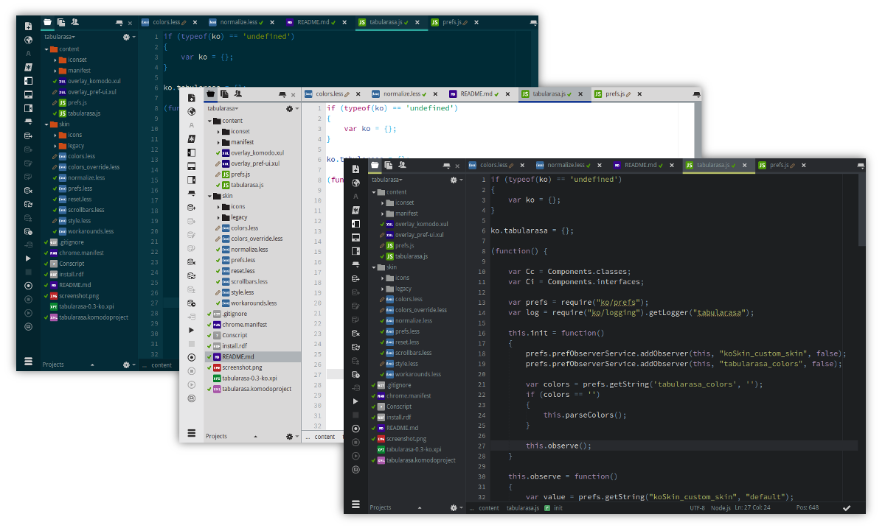

This skin is to be considered an alpha, you WILL run into issues if you use this,
they may be minor, they may be big. IF you run into issues [please report them](https://github.com/Naatan/TabulaRasa/issues).

This skin is intended to replace 90% of the base CSS in Komodo with something
very bare basic and simple that can then be extended upon. The main purpose of
this skin is to simplify the CSS in Komodo, the actual look and feel is secondary
and is currently using other skins as a point of reference.

This skin allows you to use your own colors, as well as use color themes
provided by other users.


# Roadmap (not implemented yet)

 * Color according to color scheme
 * Test, fix, test, polish, test, test ... test
 
 
# Contributing

Please note that though the project is in its early stages and therefore the code
is not as clean as it ought to be, any contributions should strive to be as clean
and tidy as possible given the current structure of the project. I'll gladly
review PR's that strive to organize the codebase, I'm waiting for the project
to take shape before I do that myself.

Contributors:

 * [Defman](https://github.com/Defman21)


# Building

```koext build --unjarred```
